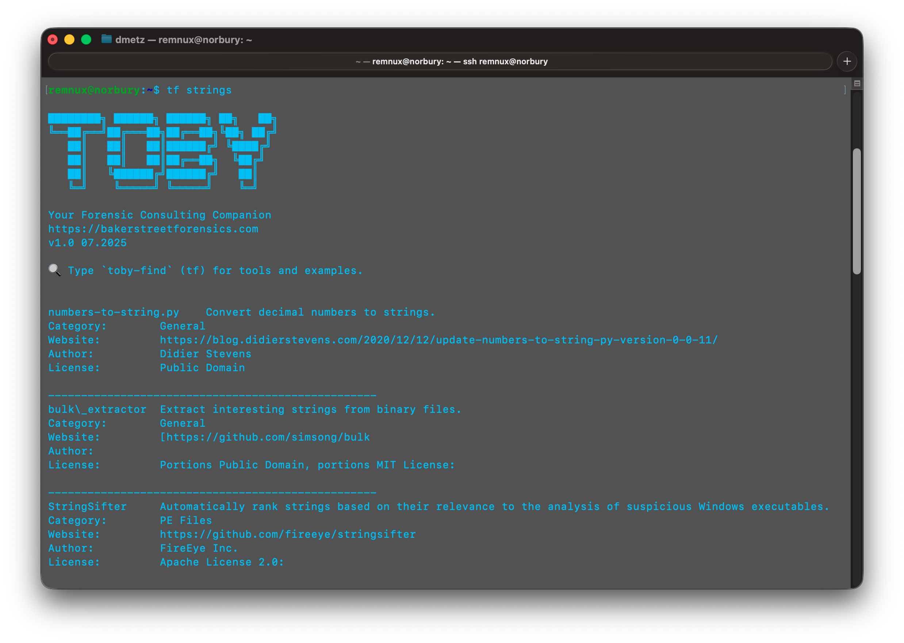
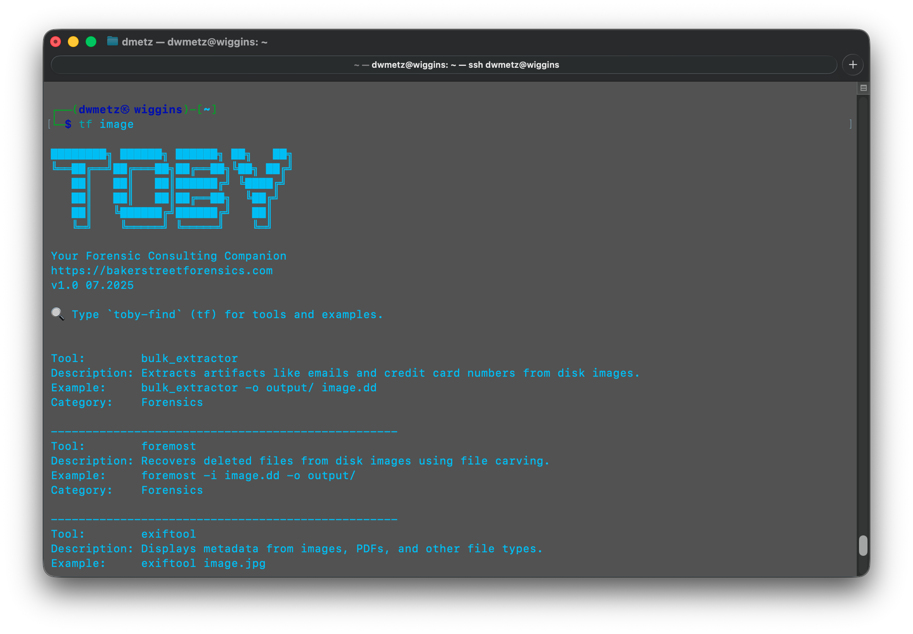

<div align="center">
 
 <p>
 <h1>
  🔎 Toby-Find
 </h1>
<p>
<p>

**Toby (Toby-Find)** is a lightweight discovery utility for terminal-based forensic tools on **KALI** and **REMnux**.

It provides quick access to tool descriptions, usage examples, and aliases — making it easy to remember what’s installed and how to use it.

---
Toby-Find on REMnux
<div align="center">
 
 <p>


Toby-Find on Kali
 <div align="center">
 
 <p>

---
<div align="left">

## 🔧 Features

- 🔍 Searchable CLI help for dozens of built-in forensic and analysis tools
- 🧾 Includes both KALI and REMnux-specific help files
- 🛠️ Auto-detects user shell (bash/zsh) and sets up aliases:
  - `tf` → main launcher
  - `tf-help` → show full help file
  - `toby-find` → same as `tf`
- 📦 Self-contained installer script, no root changes outside `/usr/local`

---

## 📦 Installation

1. Download and unzip:

   ```bash
   unzip Toby-Find.zip && cd Toby-Find
   ```

2. Make the install script executable:

   ```bash
   chmod +x install.sh
   ```

3. Run the installer:

   ```bash
   ./install.sh
   ```

4. Follow the prompt to choose your environment (KALI or REMnux)

5. Open a new terminal or run:

   ```bash
   source ~/.bashrc   # or ~/.zshrc depending on shell
   ```

---

## 🚀 Usage

```bash
tf [keyword]
```

Examples:
```bash
tf yara
tf volatility
tf hash
```

To view the full list:
```bash
tf-help
```

---

## 📁 Files

| File | Purpose |
|------|---------|
| `toby-find.sh` | Main script |
| `install.sh`   | Installs script, help file, and aliases |
| `help_files/`  | Contains `toby-cli-help-kali.txt`, `toby-cli-help-remnux.txt`, and ASCII |
| `README.md`    | This file |

---

## 🔗 Web Site

**https://bakerstreetforensics.com**  
Where Irregulars Are Part of the Game

---

## 🪪 License

MIT License — see the [MalChela GitHub](https://github.com/dwmetz/MalChela) for more forensic tooling.
